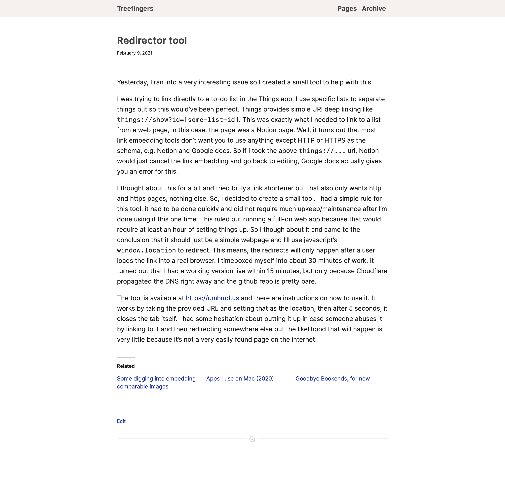

# Leaf
A theme for wordpress blogs. 
This theme is intended for blogs that are text heavy with images used sparingly. 
Don't use this theme if you have a photography blog or an image heavy blog. 

## Downloads

See [releases](https://github.com/usmanity/leaf/releases) for latest version to download.

## What it contains
This theme encourages a single pane view (no sidebars, no hamburger menus, and no popups). 
Dark mode is enabled by default (uses the system's dark mode settings to switch over). 

